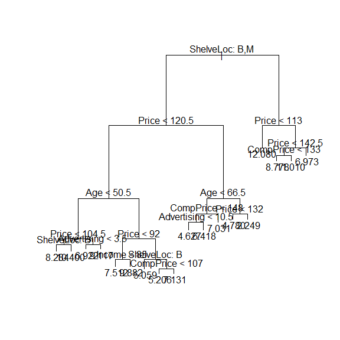
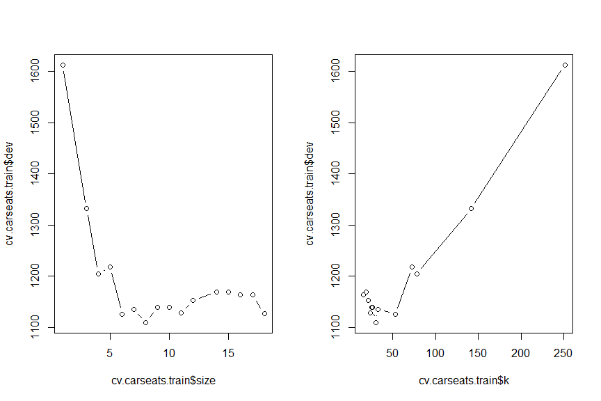
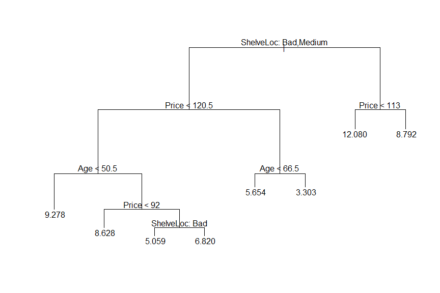
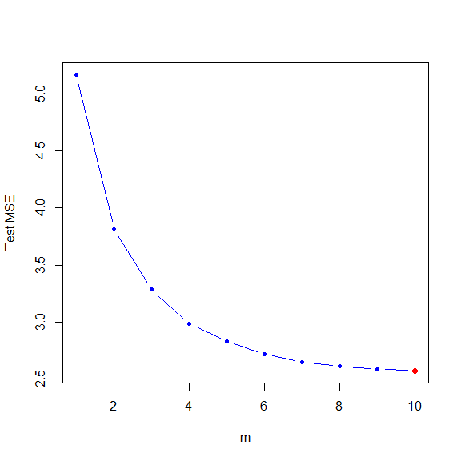
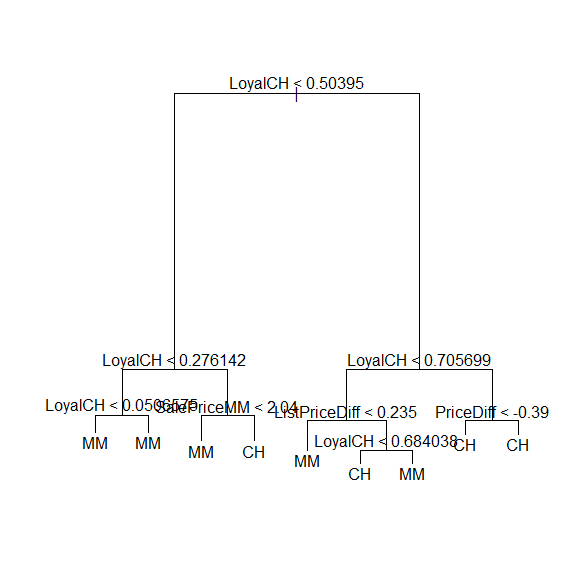
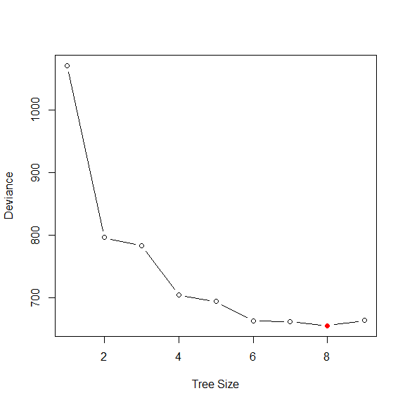
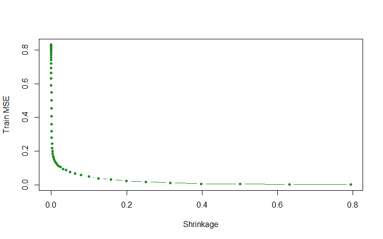
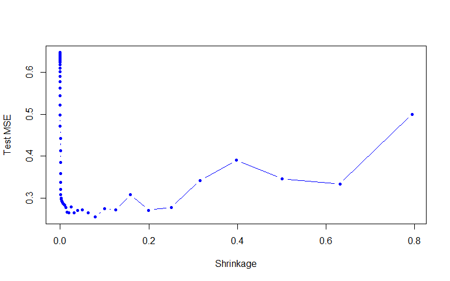
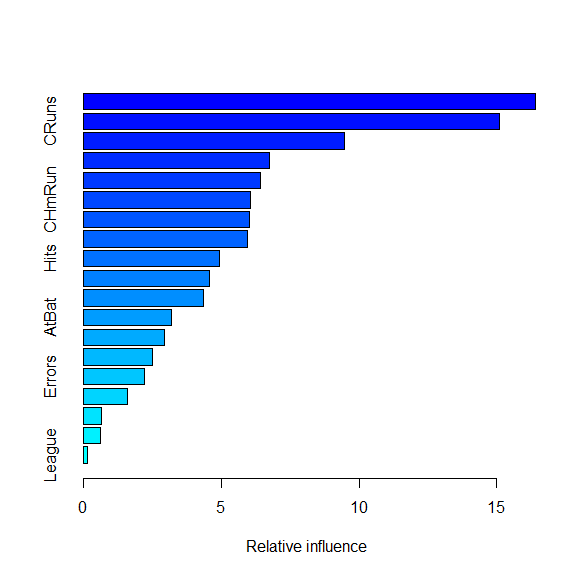

Chapter 8 Tree-Based Methods
================
Hongyun Wang
May 10, 2018

3.
==

In a setting with two classes, .  represents the proportion of observations in the *m*th region that are from the *k*th class. Here .

*Classfication error:*

 ")

 *Gini index:*

")

 *Cross-entropy:*


``` r
p = seq(0, 1, 0.001)
class.err = 1 - pmax(p, 1 - p)
gini = p * (1 - p) + (1 - p) * p
entropy = -(p * log(p) + (1 - p) * log(1 - p))
matplot(p, cbind(class.err, gini, entropy), ylab = "", type = "l", col = c("red", "green", "blue"))
legend("topright", legend = c("classification error", "gini index", "cross-entropy"), lty = 1:3, col = c("red", "green", 
    "blue"), cex = 0.8, bty = "n")
```


4.
==

4a.
---

Tree sktched corresponding to the partition diagram of the predictor space.

                     x1 < 1
               _________|__________
               |                  |
               |                  |
            x2 < 1                5
          _____|_____
          |         |
          |         |
       x1 < 0       15       
     _____|_____
     |         |
     |         |
     3      x2 < 0
          _____|_____
          |         |
          |         |
          10        0

4b.
---

Diagram created corresponding to the tree.

``` r
par(xpd = NA)
plot(NA, NA, type = "n", xlim = c(-2, 2), ylim = c(-3, 3), xlab = "X1", ylab = "X2")
# X2 < 1
lines(x = c(-2, 2), y = c(1, 1))
# X1 < 1 with X2 < 1
lines(x = c(1, 1), y = c(-3, 1))
text(x = (-2 + 1)/2, y = -1, labels = c(-1.8))
text(x = 1.5, y = -1, labels = c(0.63))
# X2 < 2 with X2 >= 1
lines(x = c(-2, 2), y = c(2, 2))
text(x = 0, y = 2.5, labels = c(2.49))
# X1 < 0 with X2<2 and X2>=1
lines(x = c(0, 0), y = c(1, 2))
text(x = -1, y = 1.5, labels = c(-1.06))
text(x = 1, y = 1.5, labels = c(0.21))
```


5.
--

Under majority vote approach, 6 out of 10 estimates of ") that are greater than or equal to 0.5. So we assume  \geq 0.5"), then the samples are classfied to **red** class.
Under average probability approach, the average probability of 10 estimate of ") is 0.45. So we assume  < 0.5"), then the samples are classfied to the other **green** class.

``` r
p = c(0.1, 0.15, 0.2, 0.2, 0.55, 0.6, 0.6, 0.65, 0.7, 0.75)
sum(p >= 0.5) > sum(p < 0.5)
```

    ## [1] TRUE

``` r
mean(p)
```

    ## [1] 0.45

7.
--

We will try a more comprehensive range of values for `mtry` () and `ntree` (from 1 to 500). Test errors will be plotted from random forest method using the above `mtry` and `ntree` values.

``` r
library(ISLR)
library(MASS)
library(randomForest)
set.seed(1)
train = sample(nrow(Boston), nrow(Boston)/2)
p = ncol(Boston) - 1
rf.boston.p = randomForest(medv ~ ., data = Boston, subset = train, xtest = Boston[-train, -14], ytest = Boston[-train, 14], 
    mtry = p, ntree = 500)
rf.boston.p2 = randomForest(medv ~ ., data = Boston, subset = train, xtest = Boston[-train, -14], ytest = Boston[-train, 
    14], mtry = p/2, ntree = 500)
rf.boston.psq = randomForest(medv ~ ., data = Boston, subset = train, xtest = Boston[-train, -14], ytest = Boston[-train, 
    14], mtry = sqrt(p), ntree = 500)

plot(1:500, rf.boston.p$test$mse, col = "green", type = "l", xlab = "Number of Trees", ylab = "Test MSE", ylim = c(10, 22))
points(1:500, rf.boston.p2$test$mse, col = "red", type = "l")
points(1:500, rf.boston.psq$test$mse, col = "blue", type = "l")
legend("topright", c("m=p", "m=p/2", expression(paste("m=", sqrt(p)))), col = c("green", "red", "blue"), cex = 1, lty = 1)
```


A signal regression tree has test MSE of about 20. As the number of trees increases, the test MSE drops and stablizes at about 200 trees. *Random forests* () lead to a slight improvement over *bagging* ().

8.
==

8a.
---

Split the data set `Carseats` into a training set and a test set.

``` r
rm(list = ls())
library(ISLR)
set.seed(1)
train = sample(nrow(Carseats), nrow(Carseats)/2)
Carseats.train = Carseats[train, ]
Carseats.test = Carseats[-train, ]
```

8b.
---

Fit a regression tree to the training tree.

``` r
library(tree)
tree.carseats.train = tree(Sales ~ ., data = Carseats.train)
summary(tree.carseats.train)
```

    ## 
    ## Regression tree:
    ## tree(formula = Sales ~ ., data = Carseats.train)
    ## Variables actually used in tree construction:
    ## [1] "ShelveLoc"   "Price"       "Age"         "Advertising" "Income"     
    ## [6] "CompPrice"  
    ## Number of terminal nodes:  18 
    ## Residual mean deviance:  2.36 = 429.5 / 182 
    ## Distribution of residuals:
    ##    Min. 1st Qu.  Median    Mean 3rd Qu.    Max. 
    ## -4.2570 -1.0360  0.1024  0.0000  0.9301  3.9130

``` r
plot(tree.carseats.train)
text(tree.carseats.train, pretty = 1)
```



``` r
pred.carseats.test = predict(tree.carseats.train, Carseats.test)
(mse.test = mean((Carseats.test$Sales - pred.carseats.test)^2))
```

    ## [1] 4.148897

The test MSE is 4.15.

8c.
---

Use cross validation to determine the optimal levels of tree complexity.

``` r
set.seed(1)
cv.carseats.train = cv.tree(tree.carseats.train, FUN = prune.tree)
par(mfrow = c(1, 2))
plot(cv.carseats.train$size, cv.carseats.train$dev, type = "b")
plot(cv.carseats.train$k, cv.carseats.train$dev, type = "b")
```



``` r
nnode = cv.carseats.train$size[which.min(cv.carseats.train$dev)]

pruned.carseats.train = prune.tree(tree.carseats.train, best = nnode)
par(mfrow = c(1, 1))
plot(pruned.carseats.train)
text(pruned.carseats.train, pretty = 0)
```



``` r
pred.pruned.test = predict(pruned.carseats.train, Carseats.test)
(pruned.mse.test = mean((Carseats.test$Sales - pred.pruned.test)^2))
```

    ## [1] 5.09085

The tree with 8 terminal nodes results in the lowest cross-validation error rate. After applying `prune.tree()` function in order to prune the tree to obtain the 8-node tree, the test MSE is 5.09. In this case, pruning the tree doesn't improve the test MSE.

8d.
---

``` r
bag.carseats = randomForest(Sales ~ ., data = Carseats.train, mtry = ncol(Carseats.train) - 1, ntree = 500, importance = TRUE)
bag.pred = predict(bag.carseats, Carseats.test)
(bag.test.mse = mean((Carseats.test$Sales - bag.pred)^2))
```

    ## [1] 2.588486

``` r
importance(bag.carseats)
```

    ##               %IncMSE IncNodePurity
    ## CompPrice   13.743690    128.760199
    ## Income       3.640159     74.882915
    ## Advertising 16.126838    123.784498
    ## Population   2.319493     62.284127
    ## Price       53.729997    508.091822
    ## ShelveLoc   43.864134    323.461715
    ## Age         21.009078    190.312978
    ## Education    2.318205     41.002285
    ## Urban       -1.145363      9.323406
    ## US           7.434434     15.172556

The test MSE was improved to 2.59 by using the *bagging* approach. Three most important variables are `Price`, `ShelveLoc` and `Age`.

8e.
---

``` r
rf.test.mse = rep(NA, 10)
for (i in seq(10)) {
    rf.test.mse1 = rep(NA, 10)
    for (j in seq(10)) {
        rf.carseats = randomForest(Sales ~ ., data = Carseats.train, xtest = Carseats.test[, -1], ytest = Carseats.test[, 
            1], mtry = i, ntree = 500, importance = T)
        rf.test.mse1[j] = rf.carseats$test$mse[500]
    }
    rf.test.mse[i] = mean(rf.test.mse1)
}
rf.test.mse
```

    ##  [1] 5.206163 3.827338 3.297875 3.015945 2.816126 2.704394 2.661840
    ##  [8] 2.600174 2.576479 2.573734

``` r
which.min(rf.test.mse)
```

    ## [1] 10

``` r
plot(rf.test.mse, xlab = "m", ylab = "Test MSE", typ = "b", pch = 20, col = "blue")
points(which.min(rf.test.mse), min(rf.test.mse), pch = 19, col = "red")
```



``` r
set.seed(1)
rf.carseats = randomForest(Sales ~ ., data = Carseats.train, mtry = 5, ntree = 500, importance = T)
rf.pred = predict(rf.carseats, Carseats.test)
(rf.carseats.test = mean((Carseats.test$Sales - rf.pred)^2))
```

    ## [1] 2.886063

``` r
importance(rf.carseats)
```

    ##               %IncMSE IncNodePurity
    ## CompPrice   10.800312     126.65635
    ## Income       5.651055     108.39579
    ## Advertising 12.558782     137.09292
    ## Population   0.457346      80.14942
    ## Price       46.132149     454.15244
    ## ShelveLoc   37.505302     277.01820
    ## Age         17.349023     200.13441
    ## Education    1.336508      54.06071
    ## Urban        0.200882      10.68013
    ## US           4.880673      24.87075

When setting ntree=500, the test MSE is getting worser as *m* decreases from 10 to 1. This means *random forests* didn't improve test MST comparing to *bagging* approach. The test MSE when choosing  is 2.8860625. The three most important variables are `Price`, `ShelveLoc` and `Age`.

9.
==

9a.
---

``` r
library(ISLR)
set.seed(999)
train = sample(nrow(OJ), 800)
OJ.train = OJ[train, ]
OJ.test = OJ[-train, ]
```

9b.
---

``` r
library(tree)
oj.tree = tree(Purchase ~ ., data = OJ.train)
summary(oj.tree)
```

    ## 
    ## Classification tree:
    ## tree(formula = Purchase ~ ., data = OJ.train)
    ## Variables actually used in tree construction:
    ## [1] "LoyalCH"       "SalePriceMM"   "ListPriceDiff" "PriceDiff"    
    ## Number of terminal nodes:  9 
    ## Residual mean deviance:  0.7234 = 572.2 / 791 
    ## Misclassification error rate: 0.16 = 128 / 800

The tree uses 4 variables: `LoyalCH`, `SalePriceMM`, `ListPriceDiff`, `PriceDiff`. Trainning error rate is 0.16 and there are 9 terminal nodes.

9c.
---

``` r
oj.tree
```

    ## node), split, n, deviance, yval, (yprob)
    ##       * denotes terminal node
    ## 
    ##  1) root 800 1069.000 CH ( 0.61125 0.38875 )  
    ##    2) LoyalCH < 0.50395 351  421.300 MM ( 0.28775 0.71225 )  
    ##      4) LoyalCH < 0.276142 165  117.900 MM ( 0.11515 0.88485 )  
    ##        8) LoyalCH < 0.0506575 57    0.000 MM ( 0.00000 1.00000 ) *
    ##        9) LoyalCH > 0.0506575 108  100.500 MM ( 0.17593 0.82407 ) *
    ##      5) LoyalCH > 0.276142 186  255.200 MM ( 0.44086 0.55914 )  
    ##       10) SalePriceMM < 2.04 96  110.100 MM ( 0.26042 0.73958 ) *
    ##       11) SalePriceMM > 2.04 90  118.300 CH ( 0.63333 0.36667 ) *
    ##    3) LoyalCH > 0.50395 449  356.800 CH ( 0.86414 0.13586 )  
    ##      6) LoyalCH < 0.705699 149  184.200 CH ( 0.69128 0.30872 )  
    ##       12) ListPriceDiff < 0.235 63   86.560 MM ( 0.44444 0.55556 ) *
    ##       13) ListPriceDiff > 0.235 86   65.770 CH ( 0.87209 0.12791 )  
    ##         26) LoyalCH < 0.684038 81   47.660 CH ( 0.91358 0.08642 ) *
    ##         27) LoyalCH > 0.684038 5    5.004 MM ( 0.20000 0.80000 ) *
    ##      7) LoyalCH > 0.705699 300  119.100 CH ( 0.95000 0.05000 )  
    ##       14) PriceDiff < -0.39 13   17.320 CH ( 0.61538 0.38462 ) *
    ##       15) PriceDiff > -0.39 287   86.790 CH ( 0.96516 0.03484 ) *

Terminal node labeled "10)", the splitting variable is `SalePriceMM`. The splitting value of this node is 2.04. There are 96 observations in the subtree below this node. The deviance for all observations contained in region below this node is 110.1. Asterisk is used to indicate that the brance can lead to terminal nodes. The `Purchase` prediction at this node is **MM**. **26%** of observations at this node have `Purchase` value as `CH` and **74%** of observations at this node have `Purchase` value as **MM**.

9d.
---

``` r
plot(oj.tree)
text(oj.tree, pretty = 0)
```



`LoyalCH` is the most important variable of the tree. The root node and next two nodes contain `LoyalCH`. When `LoyalCH` &lt; **0.28**, the tree predicts **MM**. When `LoyalCH` &gt; **0.71**, the tree predicts **CH**. For intermediate values of `LoyalCH`, the decision also depends on the valueS of `SalePriceMM` and `ListPriceDiff`.

9e.
---

``` r
oj.pred = predict(oj.tree, OJ.test, type = "class")
(out = table(OJ.test$Purchase, oj.pred))
```

    ##     oj.pred
    ##       CH  MM
    ##   CH 133  31
    ##   MM  28  78

The test error rate is 0.22.

9f.
---

Apply `cv.tree()` function to the training set in order to determine the optimal tree size.

``` r
cv.oj = cv.tree(oj.tree, FUN = prune.tree)
```

9g.
---

``` r
plot(cv.oj$size, cv.oj$dev, type = "b", xlab = "Tree Size", ylab = "Deviance")
points(cv.oj$size[which.min(cv.oj$dev)], min(cv.oj$dev), pch = 19, col = "red")
```



9h.
---

Tree size **8** gives the lowest cross-validated classfication error rate.

9i.
---

Produce a pruned tree correspoding to optimal tree size **8**.

``` r
oj.pruned = prune.tree(oj.tree, best = cv.oj$size[which.min(cv.oj$dev)])
```

9j.
---

``` r
summary(oj.pruned)
```

    ## 
    ## Classification tree:
    ## snip.tree(tree = oj.tree, nodes = 13L)
    ## Variables actually used in tree construction:
    ## [1] "LoyalCH"       "SalePriceMM"   "ListPriceDiff" "PriceDiff"    
    ## Number of terminal nodes:  8 
    ## Residual mean deviance:  0.739 = 585.3 / 792 
    ## Misclassification error rate: 0.1638 = 131 / 800

The training error rate for the pruned tree is **0.1638**, which is slightly higher than training error rate **0.16** for the unpruned tree.

9k.
---

``` r
pred.unpruned = predict(oj.tree, OJ.test, type = "class")
(table1 = table(OJ.test$Purchase, pred.unpruned))
```

    ##     pred.unpruned
    ##       CH  MM
    ##   CH 133  31
    ##   MM  28  78

``` r
1 - round(sum(diag(table1))/sum(table1), 4)
```

    ## [1] 0.2185

``` r
pred.pruned = predict(oj.pruned, OJ.test, type = "class")
(table2 = table(OJ.test$Purchase, pred.pruned))
```

    ##     pred.pruned
    ##       CH  MM
    ##   CH 134  30
    ##   MM  28  78

``` r
1 - round(sum(diag(table2))/sum(table2), 4)
```

    ## [1] 0.2148

The test error rate for the unpruned tree is **0.2185**, which is slightly higher than training error rate **0.2148** for the pruned tree.

10.
---

10a.
----

``` r
library(ISLR)
suppressMessages(library(dplyr))
attach(Hitters)
Hitters = Hitters %>% dplyr::filter(!is.na(Salary)) %>% mutate(Salary = log(Salary))
```

10b.
----

``` r
train = Hitters[1:200, ]
test = Hitters[-c(1:200), ]
```

10c.
----

``` r
suppressMessages(library(gbm))
set.seed(1)
lambdas = 10^seq(-10, -0.1, by = 0.1)

train.errors = rep(NA, length(lambdas))
test.errors = rep(NA, length(lambdas))
for (i in seq_along(lambdas)) {
    boost.hitters = gbm(Salary ~ ., data = train, distribution = "gaussian", n.trees = 1000, shrinkage = lambdas[i])
    train.pred = predict(boost.hitters, newdata = train, n.trees = 1000)
    test.pred = predict(boost.hitters, newdata = test, n.trees = 1000)
    train.errors[i] = mean((train$Salary - train.pred)^2)
    test.errors[i] = mean((test$Salary - test.pred)^2)
}

plot(lambdas, train.errors, type = "b", xlab = "Shrinkage", ylab = "Train MSE", col = "forestgreen", pch = 20)
```



10d.
----

``` r
plot(lambdas, test.errors, type = "b", xlab = "Shrinkage", ylab = "Test MSE", col = "blue", pch = 20)
```



``` r
min(test.errors)
```

    ## [1] 0.2540265

``` r
lambdas[which.min(test.errors)]
```

    ## [1] 0.07943282

The minimum test MSE **0.254** was achieved at **lambda** = **0.0794**

10e.
----

Fit linear model.

``` r
lm.fit = lm(Salary ~ ., data = train)
lm.pred = predict(lm.fit, test)
mean((test$Salary - lm.pred)^2)
```

    ## [1] 0.4917959

Fit lasso.

``` r
suppressMessages(library(glmnet))
set.seed(1)
x = model.matrix(Salary ~ ., data = train)
y = train$Salary
x.test = model.matrix(Salary ~ ., data = test)
lasso.fit = glmnet(x, y, alpha = 1)
lasso.pred = predict(lasso.fit, s = 0.01, newx = x.test)
mean((test$Salary - lasso.pred)^2)
```

    ## [1] 0.4700537

The *linear model* has test MSE 0.4918 and *lasso model* has test MSE 0.4701. Both test MSE are higher than test MSE from *boosting*.

10f.
----

``` r
boost.best = gbm(Salary ~ ., data = train, distribution = "gaussian", n.trees = 1000, shrinkage = lambdas[which.min(test.errors)])
summary(boost.best)
```



    ##                 var    rel.inf
    ## CAtBat       CAtBat 16.4028631
    ## CRuns         CRuns 15.0957847
    ## PutOuts     PutOuts  9.4543457
    ## CWalks       CWalks  6.7508573
    ## CRBI           CRBI  6.4133341
    ## CHmRun       CHmRun  6.0778920
    ## Walks         Walks  6.0434466
    ## Years         Years  5.9694890
    ## Hits           Hits  4.9492273
    ## Assists     Assists  4.5706789
    ## RBI             RBI  4.3533790
    ## AtBat         AtBat  3.1830285
    ## HmRun         HmRun  2.9616488
    ## Runs           Runs  2.5244563
    ## Errors       Errors  2.2067482
    ## CHits         CHits  1.5986893
    ## Division   Division  0.6707407
    ## NewLeague NewLeague  0.6083337
    ## League       League  0.1650564

`CAtBat` and `CRuns` are the two most important predictors in the boosted model.

10g.
----

``` r
suppressMessages(library(randomForest))
set.seed(1)
bag.hitters = randomForest(Salary ~ ., data = train, ntree = 500, mtry = 19)
bag.pred = predict(bag.hitters, test)
mean((test$Salary - bag.pred)^2)
```

    ## [1] 0.2299324

The *bagging* test MSE 0.2299 is lower than *boosting* test MSE.
