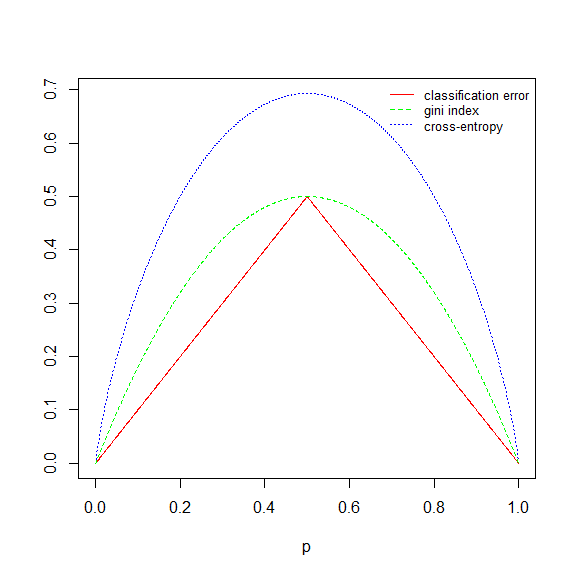
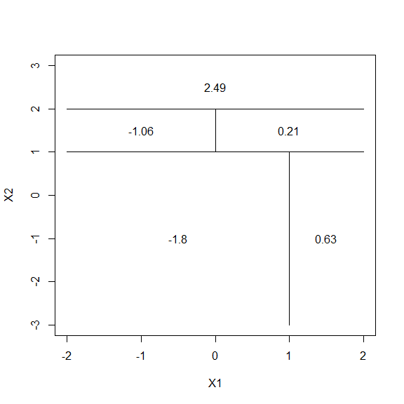

Chapter 8 Tree-Based Methods
================
Hongyun Wang
May 6, 2018

3.
--

In a setting with two classes, .  represents the proportion of observations in the *m*th region that are from the *k*th class. Here .

*Classfication error:*

 ")

 *Gini index:*

")

 *Cross-entropy:*


``` r
p = seq(0, 1, 0.001)
class.err = 1 - pmax(p, 1 - p)
gini = p * (1 - p) + (1 - p) * p
entropy = -(p * log(p) + (1 - p) * log(1 - p))
matplot(p, cbind(class.err, gini, entropy), ylab = "", type = "l", col = c("red", "green", "blue"))
legend("topright", legend = c("classification error", "gini index", "cross-entropy"), lty = 1:3, col = c("red", "green", 
    "blue"), cex = 0.8, bty = "n")
```



4a.
---

Tree sktched corresponding to the partition diagram of the predictor space.

                     x1 < 1
               _________|__________
               |                  |
               |                  |
            x2 < 1                5
          _____|_____
          |         |
          |         |
       x1 < 0       15       
     _____|_____
     |         |
     |         |
     3      x2 < 0
          _____|_____
          |         |
          |         |
          10        0

4b.
---

Diagram created corresponding to the tree.

``` r
par(xpd = NA)
plot(NA, NA, type = "n", xlim = c(-2, 2), ylim = c(-3, 3), xlab = "X1", ylab = "X2")
# X2 < 1
lines(x = c(-2, 2), y = c(1, 1))
# X1 < 1 with X2 < 1
lines(x = c(1, 1), y = c(-3, 1))
text(x = (-2 + 1)/2, y = -1, labels = c(-1.8))
text(x = 1.5, y = -1, labels = c(0.63))
# X2 < 2 with X2 >= 1
lines(x = c(-2, 2), y = c(2, 2))
text(x = 0, y = 2.5, labels = c(2.49))
# X1 < 0 with X2<2 and X2>=1
lines(x = c(0, 0), y = c(1, 2))
text(x = -1, y = 1.5, labels = c(-1.06))
text(x = 1, y = 1.5, labels = c(0.21))
```



5.
--

Under majority vote approach, 6 out of 10 estimates of ") that are greater than or equal to 0.5. So we assume  \geq 0.5"), then the samples are classfied to **red** class.
Under average probability approach, the average probability of 10 estimate of ") is 0.45. So we assume  < 0.5"), then the samples are classfied to the other **green** class.

``` r
p = c(0.1, 0.15, 0.2, 0.2, 0.55, 0.6, 0.6, 0.65, 0.7, 0.75)
sum(p >= 0.5) > sum(p < 0.5)
```

    ## [1] TRUE

``` r
mean(p)
```

    ## [1] 0.45

7.
--

We will try a more comprehensive range of values for `mtry` () and `ntree` (from 1 to 500). Test errors will be plotted from random forest method using the above `mtry` and `ntree` values.

``` r
library(ISLR)
library(MASS)
library(randomForest)
set.seed(1)
train = sample(nrow(Boston), nrow(Boston)/2)
p = ncol(Boston) - 1
rf.boston.p = randomForest(medv ~ ., data = Boston, subset = train, xtest = Boston[-train, -14], ytest = Boston[-train, 14], 
    mtry = p, ntree = 500)
rf.boston.p2 = randomForest(medv ~ ., data = Boston, subset = train, xtest = Boston[-train, -14], ytest = Boston[-train, 
    14], mtry = p/2, ntree = 500)
rf.boston.psq = randomForest(medv ~ ., data = Boston, subset = train, xtest = Boston[-train, -14], ytest = Boston[-train, 
    14], mtry = sqrt(p), ntree = 500)

plot(1:500, rf.boston.p$test$mse, col = "green", type = "l", xlab = "Number of Trees", ylab = "Test MSE", ylim = c(10, 22))
points(1:500, rf.boston.p2$test$mse, col = "red", type = "l")
points(1:500, rf.boston.psq$test$mse, col = "blue", type = "l")
legend("topright", c("m=p", "m=p/2", expression(paste("m=", sqrt(p)))), col = c("green", "red", "blue"), cex = 1, lty = 1)
```

 A signal regression tree has test MSE of about 20. As the number of trees increases, the test MSE drops and stablizes at about 200 trees. *Random forests* () lead to a slight improvement over *bagging* ().
