# 1.
## 1.(a)

```r
x1 = -10:10
x2 = 1 + 3 * x1
plot(x1, x2, xlim = c(-10, 10), ylim = c(-30, 30), type = "l", col = "red")
text(-5, 10, expression(paste("1 + 3", italic(X[1]), " - ", italic(X[2]), " < 0")), col = "red")
text(5, -10, expression(paste("1 + 3", italic(X[1]), " - ", italic(X[2]), " > 0")), col = "red")
```

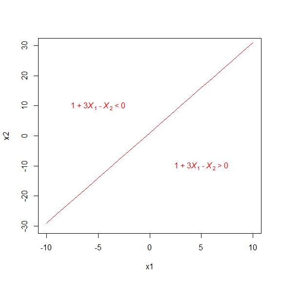

## 1.(b)

```r
x1 = -10:10
x2 = 1 - x1/2
plot(x1, x2, xlim = c(-10, 10), ylim = c(-30, 30), type = "l", col = "blue")
text(0, -15, expression(paste("-2 +", italic(X[1]), " + 2 ", italic(X[2]), " < 0")), col = "blue")
text(0, 15, expression(paste("-2 +", italic(X[1]), " + 2 ", italic(X[2]), " > 0")), col = "blue")
```


# 2.
$(1 + X_{1})^2 + (2 - X_{2})^2 = 4$ is a circle with radius 2 and center (-1, 2).

## 2.(a)

```r
radius = 2
plot(NA, NA, type = "n", xlim = c(-4, 2), ylim = c(-1, 5), asp = 1, xlab = "X1", ylab = "X2")
symbols(-1, 2, circles = radius, add = TRUE, inches = FALSE)
```


## 2.(b)

```r
radius = 2
plot(NA, NA, type = "n", xlim = c(-4, 2), ylim = c(-1, 5), asp = 1, xlab = "X1", ylab = "X2")
symbols(c(-1), c(2), circles = c(radius), add = TRUE, inches = FALSE)
text(-1, 2, "< 4", col = "red")
text(-4, 2, "> 4", col = "blue")
text(-1, -0.5, "> 4", col = "blue")
text(2, 2, "> 4", col = "blue")
text(-1, 4.5, "> 4", col = "blue")
```


## 2.(c)

```r
radius = 2
plot(NA, NA, type = "n", xlim = c(-4, 4), ylim = c(-1, 8), asp = 1, xlab = "X1", ylab = "X2")
symbols(c(-1), c(2), circles = c(radius), add = TRUE, inches = FALSE)
text(-1, 2, "< 4", col = "red")
text(-4, 2, "> 4", col = "blue")
points(c(0, -1, 2, 3), c(0, 1, 2, 8), col = c("blue", "red", "blue", "blue"), pch = 16)
```

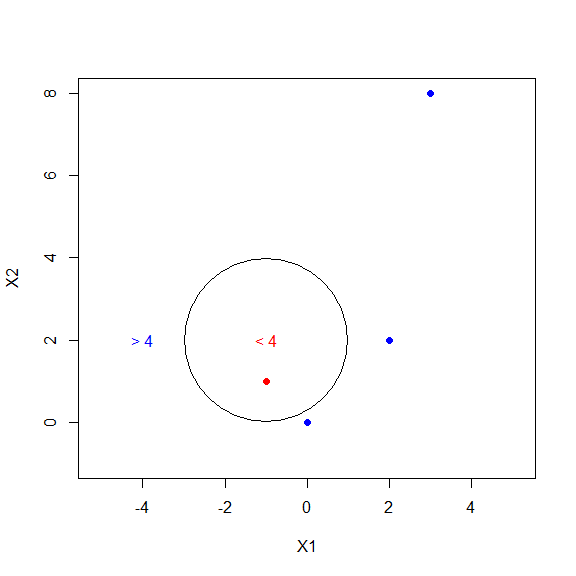

## 2.(d)
Expand the formula below,  
$$(1 + X_{1})^2 + (2 - X_{2})^2 > 4$$
then we get  
$$4 + 2X_1 - 4X_2 +X_{1}^2 + X_{2}^2 > 0$$
which is linear in terms of $X_1$, $X_2$, $X_{1}^2$ and $X_{2}^2$.

#3.
## 3.(a)

```r
x1 = c(3, 2, 4, 1, 2, 4, 4)
x2 = c(4, 2, 4, 4, 1, 3, 1)
colors = c(rep("red", 4), rep("blue", 3))
plot(x1, x2, col = colors, pch = 16, asp = 1, xlim = c(0, 5), ylim = c(0, 5))
text(x1, x2, 1:7, pos = 4)
```


## 3.(b)
According to the scattorplot, it is easy to see observations #2 (2,2), #3 (4,4), #5 (2,1), #6 (4,3) are the support vectors. And the line passing observations 2 and 3 and the line passing observations 5 and 6 are parallel and both the lines have slope $b = \frac {4-2} {4-2} = \frac {3-1} {4-2} = 1$. Then the maximal boundary is a line in the middle of those two lines with the same slope $b=1$. The line also pass $(X_1, X_2) = (2, \frac{2+1}{2}) = (2,1.5)$ and $(X_1, X_2) = (4, \frac{4+3}{2}) = (4,3.5)$, then the intercept is $a = X_2 - bX_1 = 1.5 - 1 \times 2 = 3.5 - 1 \times 4 = -0.5$.

```r
plot(x1, x2, col = colors, pch = 16, xlim = c(0, 5), ylim = c(0, 5))
abline(-0.5, 1)
```


## 3.(c)
$0.5 - X_1 + X_2 > 0$  Classfify to Red,
$0.5 - X_1 + X_2 < 0$  Classfify to Blue.

## 3.(d)

```r
plot(x1, x2, col = colors, pch = 16, xlim = c(0, 5), ylim = c(0, 5))
abline(-0.5, 1, lwd = 2)
abline(-1, 1, lty = 2)
abline(0, 1, lty = 2)
```

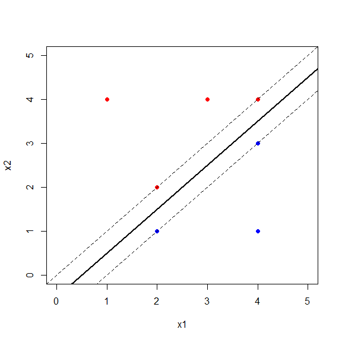

## 3.(e)
There are 4 support vectors:observations #2 (2,2), #3 (4,4), #5 (2,1), #6 (4,3).

```r
plot(x1, x2, col = colors, pch = 16, xlim = c(0, 5), ylim = c(0, 5))
abline(-0.5, 1, lwd = 2)
abline(-1, 1, lty = 2)
abline(0, 1, lty = 2)
arrows(2, 1, 1.75, 1.25, code = 2)
arrows(2, 2, 2.25, 1.75)
arrows(4, 3, 3.75, 3.25)
arrows(4, 4, 4.25, 3.75)
```

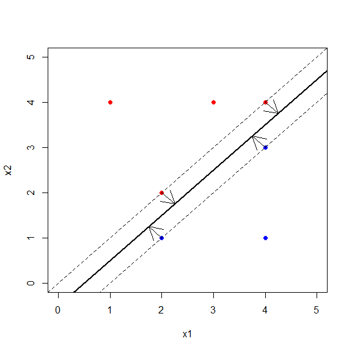

## 3.(f)
A slight movement of observation #7 (4,1) would not affect the maximal margin hyperplane as long as its movement is outside of the margin for the maximal margin hyperplane.

## 3.(g)

```r
plot(x1, x2, col = colors, pch = 16, xlim = c(0, 5), ylim = c(0, 5))
abline(-0.6, 1.1)
```


$0.6 - 1.1X_1 + X_2 = 0$

## 3.(h)

```r
plot(x1, x2, col = colors, pch = 16, xlim = c(0, 5), ylim = c(0, 5))
points(3.5, 1.5, pch = 16, col = "red")
text(3.5, 1.5, pos = 4, "new")
```


# 4.

```r
set.seed(1000)
x1 = rnorm(100)
x2 = 2 * x1^2 - 3 + rnorm(100)
class1 = sample(100, 50)
x2[class1] = x2[class1] + 2
x2[-class1] = x2[-class1] - 2
# Plot using different colors
plot(x1[class1], x2[class1], pch = 4, col = "red", xlim = c(-3, 4), ylim = c(-10, 15), xlab = "X1", ylab = "X2")
points(x1[-class1], x2[-class1], col = "blue")
```


```r
set.seed(300)
z = rep(0, 100)
z[class1] = 1
# Take 25 observations each from train and -train
final.train = c(sample(class1, 25), sample(setdiff(1:100, class1), 25))
data.train = data.frame(x1 = x1[final.train], x2 = x2[final.train], z = as.factor(z[final.train]))
data.test = data.frame(x1 = x1[-final.train], x2 = x2[-final.train], z = as.factor(z[-final.train]))
# Plot using different colors
plot(subset(data.train, z == 1)[, c(1:2)], pch = 4, col = "red", xlim = c(-3, 4), ylim = c(-10, 15), xlab = "X1", ylab = "X2")
points(subset(data.train, z == 0)[, c(1:2)], col = "blue")
points(subset(data.test, z == 1)[, c(1:2)], pch = 3, col = "purple")
points(subset(data.test, z == 0)[, c(1:2)], pch = 16, col = "cyan")
legend("topleft", inset = c(0.001, 0.001), pch = c(4, 1, 3, 16), legend = c("Train Class 1", "Train Class 0", "Test Class 1", 
    "Test Class 0"), col = c("red", "blue", "purple", "cyan"), cex = 0.8, pt.cex = 1, bty = "n")
```

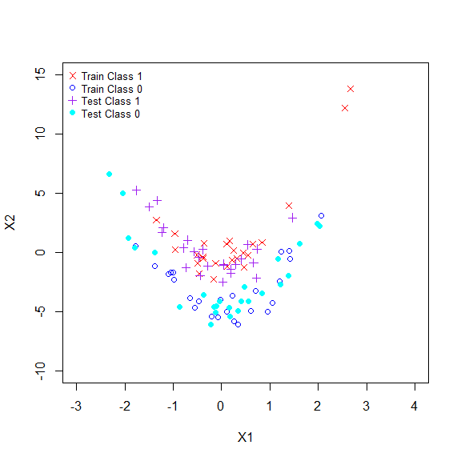


```r
suppressMessages(library(e1071))
svm.linear = svm(z ~ ., data = data.train, kernel = "linear", cost = 10)
plot(svm.linear, data.train)
```

<div class="figure" style="text-align: center">
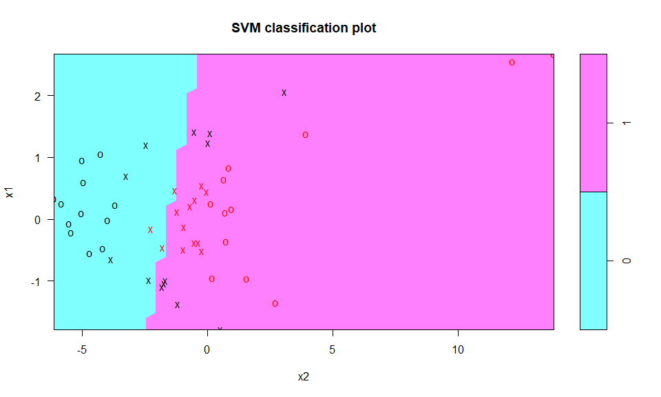
<p class="caption">Train data, linear basis kernel</p>
</div>

```r
table(z[final.train], predict(svm.linear, data.train))
```

```
##    
##      0  1
##   0 16  9
##   1  1 24
```

```r
svm.poly = svm(z ~ ., data = data.train, kernel = "polynomial", cost = 10)
plot(svm.poly, data.train)
```

<div class="figure" style="text-align: center">

<p class="caption">Train data, polynomial basis kernel</p>
</div>

```r
table(z[final.train], predict(svm.poly, data.train))
```

```
##    
##      0  1
##   0 14 11
##   1  0 25
```


```r
svm.radial = svm(z ~ ., data = data.train, kernel = "radial", gamma = 1, cost = 10)
plot(svm.radial, data.train)
```

<div class="figure" style="text-align: center">

<p class="caption">Train data, radial basis kernel</p>
</div>

```r
table(z[final.train], predict(svm.radial, data.train))
```

```
##    
##      0  1
##   0 25  0
##   1  0 25
```

Test data


```r
plot(svm.linear, data.test)
```

<div class="figure" style="text-align: center">

<p class="caption">Test data, linear basis kernel</p>
</div>

```r
table(z[-final.train], predict(svm.linear, data.test))
```

```
##    
##      0  1
##   0 16  9
##   1  4 21
```


```r
plot(svm.poly, data.test)
```

<div class="figure" style="text-align: center">

<p class="caption">Test data, polynomial basis kernel</p>
</div>

```r
table(z[-final.train], predict(svm.poly, data.test))
```

```
##    
##      0  1
##   0 15 10
##   1  0 25
```


```r
plot(svm.radial, data.test)
```

<div class="figure" style="text-align: center">
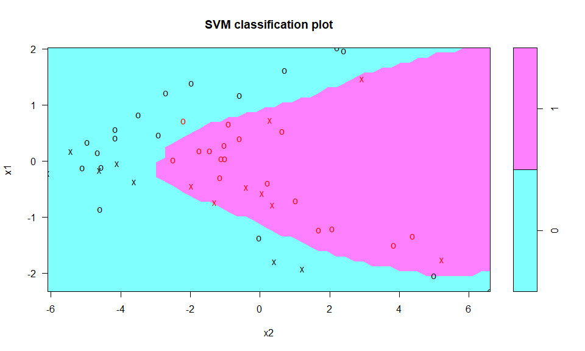
<p class="caption">Test data, radial basis kernel</p>
</div>

```r
table(z[-final.train], predict(svm.radial, data.test))
```

```
##    
##      0  1
##   0 24  1
##   1  1 24
```

# 5.
## 5.(a)

```r
set.seed(1001)
x1 = runif(500) - 0.5
x2 = runif(500) - 0.5
y = 1 * (x1^2 - x2^2 > 0)
```

## 5.(b)

```r
plot(x1[y == 0], x2[y == 0], col = "red", xlab = "X1", ylab = "X2", pch = "+")
points(x1[y == 1], x2[y == 1], col = "blue", pch = 4)
```


The plot clearly shows non-linear decision boundary.

## 5.(c)

```r
lm.fit = glm(y ~ x1 + x2, family = binomial)
summary(lm.fit)
```

```
## 
## Call:
## glm(formula = y ~ x1 + x2, family = binomial)
## 
## Deviance Residuals: 
##    Min      1Q  Median      3Q     Max  
## -1.347  -1.135  -1.019   1.183   1.340  
## 
## Coefficients:
##             Estimate Std. Error z value Pr(>|z|)  
## (Intercept) -0.01958    0.08991  -0.218   0.8276  
## x1          -0.21216    0.30894  -0.687   0.4922  
## x2           0.61616    0.31374   1.964   0.0495 *
## ---
## Signif. codes:  0 '***' 0.001 '**' 0.01 '*' 0.05 '.' 0.1 ' ' 1
## 
## (Dispersion parameter for binomial family taken to be 1)
## 
##     Null deviance: 693.08  on 499  degrees of freedom
## Residual deviance: 688.88  on 497  degrees of freedom
## AIC: 694.88
## 
## Number of Fisher Scoring iterations: 3
```
Variable **x1** is significant and **x2** is insignificant for predicting **y** when setting $\alpha = 0.05$.

## 5.(d)

```r
data = data.frame(x1 = x1, x2 = x2, y = y)
lm.prob = predict(lm.fit, data, type = "response")
lm.pred = ifelse(lm.prob > 0.5, 1, 0)
data.pos = data[lm.pred == 1, ]
data.neg = data[lm.pred == 0, ]
plot(data.pos$x1, data.pos$x2, col = "blue", xlab = "X1", ylab = "X2", pch = "+")
points(data.neg$x1, data.neg$x2, col = "red", pch = 4)
```


The decision boundary is linear as seen in the figure above.

## 5.(e)
Non-linear functions (squares, product interaction) of *X1* and *X2* are used to fit the model.

```r
lm.fit2 = glm(y ~ poly(x1, 2) + poly(x2, 2) + I(x1 * x2), data = data, family = binomial)
summary(lm.fit2)
```

```
## 
## Call:
## glm(formula = y ~ poly(x1, 2) + poly(x2, 2) + I(x1 * x2), family = binomial, 
##     data = data)
## 
## Deviance Residuals: 
##        Min          1Q      Median          3Q         Max  
## -2.163e-03  -2.000e-08  -2.000e-08   2.000e-08   1.958e-03  
## 
## Coefficients:
##                Estimate Std. Error z value Pr(>|z|)
## (Intercept)       90.44    2233.72   0.040    0.968
## poly(x1, 2)1    -157.49   48926.61  -0.003    0.997
## poly(x1, 2)2   59819.35 1091200.53   0.055    0.956
## poly(x2, 2)1    3058.08   78977.26   0.039    0.969
## poly(x2, 2)2  -58227.38 1064166.89  -0.055    0.956
## I(x1 * x2)       -74.77   19312.05  -0.004    0.997
## 
## (Dispersion parameter for binomial family taken to be 1)
## 
##     Null deviance: 6.9308e+02  on 499  degrees of freedom
## Residual deviance: 1.2400e-05  on 494  degrees of freedom
## AIC: 12
## 
## Number of Fisher Scoring iterations: 25
```

## 5.(f)

```r
lm.prob = predict(lm.fit2, data, type = "response")
lm.pred = ifelse(lm.prob > 0.5, 1, 0)
data.pos = data[lm.pred == 1, ]
data.neg = data[lm.pred == 0, ]
plot(data.pos$x1, data.pos$x2, col = "blue", xlab = "X1", ylab = "X2", pch = "+")
points(data.neg$x1, data.neg$x2, col = "red", pch = 4)
```

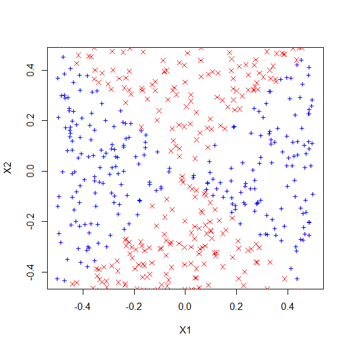
The decision boundary is obviously no-linear as seen in the figure.

## 5.(g)

```r
svm.fit = svm(as.factor(y) ~ x1 + x2, data, kernel = "linear", cost = 0.1)
svm.pred = predict(svm.fit, data)
data.pos = data[svm.pred == 1, ]
data.neg = data[svm.pred == 0, ]
plot(data.pos$x1, data.pos$x2, col = "blue", xlab = "X1", ylab = "X2", pch = "+")
points(data.neg$x1, data.neg$x2, col = "red", pch = 4)
```


A linear basis kernel, even with low cost **0.1** fails to find non-linear decision boundary.

## 5.(h)

```r
svm.fit = svm(as.factor(y) ~ x1 + x2, data, kernel = "radial", gamma = 1, cost = 0.1)
svm.pred = predict(svm.fit, data)
data.pos = data[svm.pred == 1, ]
data.neg = data[svm.pred == 0, ]
plot(data.pos$x1, data.pos$x2, col = "blue", xlab = "X1", ylab = "X2", pch = "+")
points(data.neg$x1, data.neg$x2, col = "red", pch = 4)
```


When radial basis kernel is used, the predicted decision boundary closely resembles the true decision boundary.

## 5.(i)
This experiment enforces the idea that SVMs with non-linear kernel are extremely powerful in finding non-linear boundary. Both, logistic regression with linear terms and SVMs with linear kernels fail to find the decision boundary. Adding non-linear squares and product terms to logistic regression seems to give them same power as radial-basis kernels. However, there is some manual efforts and tuning involved in picking the right non-linear terms. This effort can become prohibitive with large number of features. Radial basis kernels, on the other hand, only require tuning of one parameter - gamma - which can be easily done using cross-validation.

#6.
## 6.(a)

```r
set.seed(1)
x = matrix(rnorm(40 * 2), ncol = 2)
y = sample(c(-1, 1), 40, rep = T)
x[y == 1, ] = x[y == 1, ] + 2.5
plot(x, col = (3 - y), pch = 19)
```

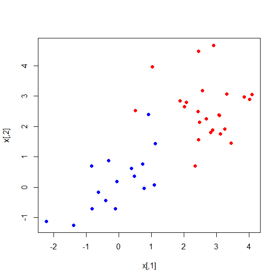

```r
dat = data.frame(x = x, y = as.factor(y))
```

## 6.(b)

```r
set.seed(1)
tune.out = tune(svm, y ~ ., data = dat, kernel = "linear", ranges = list(cost = c(0.001, 0.01, 0.1, 1, 5, 10, 100, 1000)))
summary(tune.out)
```

```
## 
## Parameter tuning of 'svm':
## 
## - sampling method: 10-fold cross validation 
## 
## - best parameters:
##  cost
##   0.1
## 
## - best performance: 0.05 
## 
## - Detailed performance results:
##    cost error dispersion
## 1 1e-03 0.400  0.2687419
## 2 1e-02 0.350  0.2687419
## 3 1e-01 0.050  0.1054093
## 4 1e+00 0.050  0.1054093
## 5 5e+00 0.050  0.1054093
## 6 1e+01 0.075  0.1207615
## 7 1e+02 0.125  0.1317616
## 8 1e+03 0.125  0.1317616
```

```r
bestmod = tune.out$best.model
summary(bestmod)
```

```
## 
## Call:
## best.tune(method = svm, train.x = y ~ ., data = dat, ranges = list(cost = c(0.001, 
##     0.01, 0.1, 1, 5, 10, 100, 1000)), kernel = "linear")
## 
## 
## Parameters:
##    SVM-Type:  C-classification 
##  SVM-Kernel:  linear 
##        cost:  0.1 
##       gamma:  0.5 
## 
## Number of Support Vectors:  16
## 
##  ( 8 8 )
## 
## 
## Number of Classes:  2 
## 
## Levels: 
##  -1 1
```

```r
plot(bestmod, dat)
```

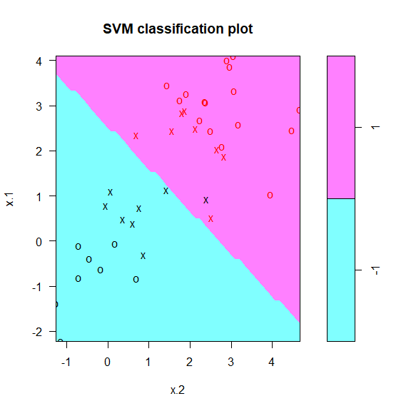

```r
table(dat$y, predict(bestmod, dat))
```

```
##     
##      -1  1
##   -1 15  1
##   1   0 24
```
We see that **cost=0.1** results in the lowest cross-validation error rate. When set **cost=0.1**, there are **16** support vectors, which are corresponding to a much wider margin. **1** out of **40** train observations is misclassfied.  


```r
svmfit = svm(y ~ ., data = dat, kernel = "linear", cost = 1e+05, scale = FALSE)
plot(svmfit, dat)
```

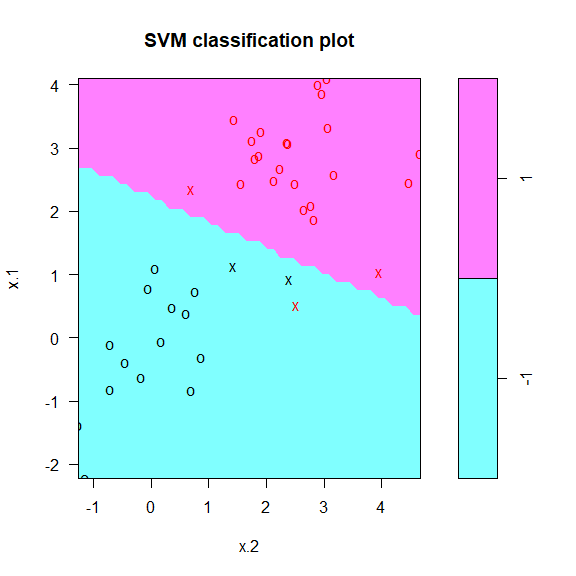

```r
table(dat$y, predict(svmfit, dat))
```

```
##     
##      -1  1
##   -1 16  0
##   1   1 23
```

When set a very large value of **cost=1e+5**, there are only **5** support vectors, which are corresponding to a much narrower margin. **1** out of **40** train observations is misclassfied.

## 6.(c)

```r
test_err_cost <- function(traindat, cost1, n) {
    svmfit_train = svm(y ~ ., data = traindat, kernel = "linear", cost = cost1, scale = FALSE)  # data is fixed as train data, but cost changes.
    table1 = table(traindat$y, predict(svmfit_train, traindat))
    err_train = round((1 - sum(diag(table1))/sum(table1)), 4)
    sv_no_train = length(svmfit_train$index)
    
    err_test <- rep(NA, n)
    for (i in 1:n) {
        xtest = matrix(rnorm(n * 2), ncol = 2)
        ytest = sample(c(-1, 1), n, rep = TRUE)
        xtest[ytest == 1, ] = xtest[ytest == 1, ] + 2.5
        testdat = data.frame(x = xtest, y = as.factor(ytest))
        
        err_test[i] = 1 - sum(diag(table(testdat$y, predict(svmfit_train, testdat))))/n
    }
    data.frame(cost.train = cost1, sv.no.train = sv_no_train, error.train = err_train, error.test = round(mean(err_test), 
        4))
}

out = do.call(rbind, lapply(c(0.001, 0.01, 0.1, 1, 5, 10, 100, 1000), test_err_cost, traindat = dat, n = 100))
suppressMessages(library(pander))

pander(out, caption = "Cost change effects on fitting train and test data", split.table = Inf, justify = rep("right", 4))
```


-----------------------------------------------------
  cost.train   sv.no.train   error.train   error.test
------------ ------------- ------------- ------------
       0.001            32           0.4          0.5

        0.01            28          0.05       0.0729

         0.1            12         0.025       0.0395

           1             7          0.05       0.0509

           5             5         0.025       0.0672

          10             5         0.025       0.0683

         100             5         0.025       0.0608

        1000             5         0.025       0.0615
-----------------------------------------------------

Table: Cost change effects on fitting train and test data

When cost changes from **0.001** to **1000** for train model, the number of support vectors decreases from **32** to **5**. Although the lowest **train error 0.025** was achieved at several costs, but the lowest **test error 0.0395** was achieved at **cost = 0.1**.

## 6.(d)
From 6(c), we can see overfitting in train data for linear kernel. A large cost corresponding to lower number of support vectors and narrower margins can correctly classify noisy observations thus overfit the train data. A small cost compromises on fitting the train data (higher train errors) but improves on fitting the test data (lower test errors).

#7.
## 7.(a)

```r
library(ISLR)
suppressMessages(library(dplyr))

data(Auto)
Auto = mutate(Auto, mpg = ifelse(Auto$mpg > median(Auto$mpg), 1, 0))
Auto$mpg = as.factor(Auto$mpg)
```

## 7.(b)

```r
set.seed(1)
tune.out = tune(svm, mpg ~ ., data = Auto, kernel = "linear", ranges = list(cost = c(0.001, 0.01, 0.1, 1, 5, 10, 100, 1000)))
summary(tune.out)
```

```
## 
## Parameter tuning of 'svm':
## 
## - sampling method: 10-fold cross validation 
## 
## - best parameters:
##  cost
##     1
## 
## - best performance: 0.09179487 
## 
## - Detailed performance results:
##    cost      error dispersion
## 1 1e-03 0.13288462 0.05551120
## 2 1e-02 0.09179487 0.05812971
## 3 1e-01 0.09692308 0.06369443
## 4 1e+00 0.09179487 0.04543280
## 5 5e+00 0.10198718 0.04338864
## 6 1e+01 0.11480769 0.05828005
## 7 1e+02 0.11730769 0.06521821
## 8 1e+03 0.11493590 0.06775226
```

```r
summary(tune.out$best.model)
```

```
## 
## Call:
## best.tune(method = svm, train.x = mpg ~ ., data = Auto, ranges = list(cost = c(0.001, 
##     0.01, 0.1, 1, 5, 10, 100, 1000)), kernel = "linear")
## 
## 
## Parameters:
##    SVM-Type:  C-classification 
##  SVM-Kernel:  linear 
##        cost:  1 
##       gamma:  0.003215434 
## 
## Number of Support Vectors:  118
## 
##  ( 52 66 )
## 
## 
## Number of Classes:  2 
## 
## Levels: 
##  0 1
```
The lowest cross-validation error **0.0918** was achieved at **cost=1**

## 7.(c)

```r
set.seed(1)
tune.out = tune(svm, mpg ~ ., data = Auto, kernel = "polynomial", ranges = list(cost = c(0.1, 1, 5, 10), degree = c(2, 3, 
    4)))
summary(tune.out)
```

```
## 
## Parameter tuning of 'svm':
## 
## - sampling method: 10-fold cross validation 
## 
## - best parameters:
##  cost degree
##    10      2
## 
## - best performance: 0.5558333 
## 
## - Detailed performance results:
##    cost degree     error dispersion
## 1   0.1      2 0.5611538 0.04344202
## 2   1.0      2 0.5611538 0.04344202
## 3   5.0      2 0.5611538 0.04344202
## 4  10.0      2 0.5558333 0.04951408
## 5   0.1      3 0.5611538 0.04344202
## 6   1.0      3 0.5611538 0.04344202
## 7   5.0      3 0.5611538 0.04344202
## 8  10.0      3 0.5611538 0.04344202
## 9   0.1      4 0.5611538 0.04344202
## 10  1.0      4 0.5611538 0.04344202
## 11  5.0      4 0.5611538 0.04344202
## 12 10.0      4 0.5611538 0.04344202
```

```r
summary(tune.out$best.model)
```

```
## 
## Call:
## best.tune(method = svm, train.x = mpg ~ ., data = Auto, ranges = list(cost = c(0.1, 
##     1, 5, 10), degree = c(2, 3, 4)), kernel = "polynomial")
## 
## 
## Parameters:
##    SVM-Type:  C-classification 
##  SVM-Kernel:  polynomial 
##        cost:  10 
##      degree:  2 
##       gamma:  0.003215434 
##      coef.0:  0 
## 
## Number of Support Vectors:  392
## 
##  ( 196 196 )
## 
## 
## Number of Classes:  2 
## 
## Levels: 
##  0 1
```
When using *polynomial* basis kernel, the lowest cross-validation error **0.5558** is obtained when **cost=10** and **degree=2**.


```r
set.seed(463)
tune.out = tune(svm, mpg ~ ., data = Auto, kernel = "radial", ranges = list(cost = c(0.1, 1, 5, 10), gamma = c(0.01, 0.1, 
    1, 5, 10, 100)))
summary(tune.out)
```

```
## 
## Parameter tuning of 'svm':
## 
## - sampling method: 10-fold cross validation 
## 
## - best parameters:
##  cost gamma
##     5   0.1
## 
## - best performance: 0.08147436 
## 
## - Detailed performance results:
##    cost gamma      error dispersion
## 1   0.1 1e-02 0.11480769 0.05302974
## 2   1.0 1e-02 0.09185897 0.05284309
## 3   5.0 1e-02 0.09692308 0.05761296
## 4  10.0 1e-02 0.09435897 0.05796611
## 5   0.1 1e-01 0.09185897 0.05284309
## 6   1.0 1e-01 0.09685897 0.05076705
## 7   5.0 1e-01 0.08147436 0.04910668
## 8  10.0 1e-01 0.09173077 0.04169071
## 9   0.1 1e+00 0.55102564 0.03813274
## 10  1.0 1e+00 0.08923077 0.05006826
## 11  5.0 1e+00 0.08666667 0.05133704
## 12 10.0 1e+00 0.08666667 0.05133704
## 13  0.1 5e+00 0.55102564 0.03813274
## 14  1.0 5e+00 0.49743590 0.03408103
## 15  5.0 5e+00 0.49993590 0.03720705
## 16 10.0 5e+00 0.49993590 0.03720705
## 17  0.1 1e+01 0.55102564 0.03813274
## 18  1.0 1e+01 0.50250000 0.04086110
## 19  5.0 1e+01 0.49993590 0.04269277
## 20 10.0 1e+01 0.49993590 0.04269277
## 21  0.1 1e+02 0.55102564 0.03813274
## 22  1.0 1e+02 0.55102564 0.03813274
## 23  5.0 1e+02 0.55102564 0.03813274
## 24 10.0 1e+02 0.55102564 0.03813274
```

```r
summary(tune.out$best.model)
```

```
## 
## Call:
## best.tune(method = svm, train.x = mpg ~ ., data = Auto, ranges = list(cost = c(0.1, 
##     1, 5, 10), gamma = c(0.01, 0.1, 1, 5, 10, 100)), kernel = "radial")
## 
## 
## Parameters:
##    SVM-Type:  C-classification 
##  SVM-Kernel:  radial 
##        cost:  5 
##       gamma:  0.1 
## 
## Number of Support Vectors:  128
## 
##  ( 60 68 )
## 
## 
## Number of Classes:  2 
## 
## Levels: 
##  0 1
```
When using *radial* basis kernel, the lowest cross-validation error **0.0815** is obtained when **cost=5** and **gamma=0.1**.

## 7.(d)

```r
svmfit.linear = svm(mpg ~ ., data = Auto, kernel = "linear", cost = 1)
svmfit.poly = svm(mpg ~ ., data = Auto, kernel = "polynomial", cost = 10, degree = 2)
svmfit.radial = svm(mpg ~ ., data = Auto, kernel = "radial", cost = 5, gamma = 0.1)

plot_pairs <- function(svmfit) {
    par(mfrow = c(2, 2))
    for (i in vars[1:(length(vars) - 1)]) {
        for (j in vars[(which(vars == i) + 1):length(vars)]) {
            plot(svmfit, Auto, as.formula(paste0(i, "~", j)))
        }
    }
}

vars = names(Auto)[!(names(Auto) %in% c("mpg", "name"))]

# plot_pairs(svmfit.linear) plot_pairs(svmfit.poly) plot_pairs(svmfit.radial)
```

# 8.
## 8.(a)

```r
set.seed(1)
train = sample(nrow(OJ), 800)
OJ.train = OJ[train, ]
OJ.test = OJ[-train, ]
```

## 8.(b)


```r
svmfit.linear = svm(Purchase ~ ., data = OJ.train, kernel = "linear", cost = 0.01)
summary(svmfit.linear)
```

```
## 
## Call:
## svm(formula = Purchase ~ ., data = OJ.train, kernel = "linear", 
##     cost = 0.01)
## 
## 
## Parameters:
##    SVM-Type:  C-classification 
##  SVM-Kernel:  linear 
##        cost:  0.01 
##       gamma:  0.05555556 
## 
## Number of Support Vectors:  432
## 
##  ( 215 217 )
## 
## 
## Number of Classes:  2 
## 
## Levels: 
##  CH MM
```
Support vector classifier creates **432** support vectors out of **800** training points. Out of these, **217** belong to level *CH* and remaining **215** belong to level *MM*.

## 8.(c)

```r
(table1 = table(OJ.train$Purchase, predict(svmfit.linear, OJ.train)))
```

```
##     
##       CH  MM
##   CH 439  55
##   MM  78 228
```

```r
(err_train = round((1 - sum(diag(table1))/sum(table1)), 4))
```

```
## [1] 0.1662
```

```r
(table2 = table(OJ.test$Purchase, predict(svmfit.linear, OJ.test)))
```

```
##     
##       CH  MM
##   CH 141  18
##   MM  31  80
```

```r
(err_test = round((1 - sum(diag(table2))/sum(table2)), 4))
```

```
## [1] 0.1815
```
The training error rate is **16.6%** and the test error rate is **18.2%**

## 8.(d)

```r
set.seed(100)
tune.out = tune(svm, Purchase ~ ., data = OJ.train, kernel = "linear", ranges = list(cost = 10^seq(-2, 1, by = 0.25)))
summary(tune.out)
```

```
## 
## Parameter tuning of 'svm':
## 
## - sampling method: 10-fold cross validation 
## 
## - best parameters:
##        cost
##  0.01778279
## 
## - best performance: 0.15875 
## 
## - Detailed performance results:
##           cost   error dispersion
## 1   0.01000000 0.16000 0.03809710
## 2   0.01778279 0.15875 0.03682259
## 3   0.03162278 0.16125 0.03458584
## 4   0.05623413 0.16250 0.03061862
## 5   0.10000000 0.16125 0.02853482
## 6   0.17782794 0.16750 0.03343734
## 7   0.31622777 0.16500 0.03525699
## 8   0.56234133 0.16375 0.03508422
## 9   1.00000000 0.16375 0.03508422
## 10  1.77827941 0.16250 0.03333333
## 11  3.16227766 0.16500 0.03162278
## 12  5.62341325 0.17125 0.03335936
## 13 10.00000000 0.17625 0.03197764
```
Tunning shows that optimal cost is **0.0178**.

## 8.(e)

```r
(table1 = table(OJ.train$Purchase, predict(tune.out$best.model, OJ.train)))
```

```
##     
##       CH  MM
##   CH 438  56
##   MM  72 234
```

```r
(err_train = round((1 - sum(diag(table1))/sum(table1)), 4))
```

```
## [1] 0.16
```

```r
(table2 = table(OJ.test$Purchase, predict(tune.out$best.model, OJ.test)))
```

```
##     
##       CH  MM
##   CH 140  19
##   MM  31  80
```

```r
(err_test = round((1 - sum(diag(table2))/sum(table2)), 4))
```

```
## [1] 0.1852
```
The training error rate is **16%** and the test error rate is **18.5%**

## 8.(f)

```r
svmfit.radial = svm(Purchase ~ ., data = OJ.train, kernel = "radial")
summary(svmfit.radial)
```

```
## 
## Call:
## svm(formula = Purchase ~ ., data = OJ.train, kernel = "radial")
## 
## 
## Parameters:
##    SVM-Type:  C-classification 
##  SVM-Kernel:  radial 
##        cost:  1 
##       gamma:  0.05555556 
## 
## Number of Support Vectors:  379
## 
##  ( 188 191 )
## 
## 
## Number of Classes:  2 
## 
## Levels: 
##  CH MM
```

```r
(table1 = table(OJ.train$Purchase, predict(svmfit.radial, OJ.train)))
```

```
##     
##       CH  MM
##   CH 455  39
##   MM  77 229
```

```r
(err_train = round((1 - sum(diag(table1))/sum(table1)), 4))
```

```
## [1] 0.145
```

```r
(table2 = table(OJ.test$Purchase, predict(svmfit.radial, OJ.test)))
```

```
##     
##       CH  MM
##   CH 141  18
##   MM  28  83
```

```r
(err_test = round((1 - sum(diag(table2))/sum(table2)), 4))
```

```
## [1] 0.1704
```

```r
set.seed(100)
tune.out = tune(svm, Purchase ~ ., data = OJ.train, kernel = "radial", ranges = list(cost = 10^seq(-2, 1, by = 0.25)))
summary(tune.out)
```

```
## 
## Parameter tuning of 'svm':
## 
## - sampling method: 10-fold cross validation 
## 
## - best parameters:
##       cost
##  0.5623413
## 
## - best performance: 0.16125 
## 
## - Detailed performance results:
##           cost   error dispersion
## 1   0.01000000 0.38250 0.05210833
## 2   0.01778279 0.38250 0.05210833
## 3   0.03162278 0.38000 0.05470883
## 4   0.05623413 0.20625 0.03498512
## 5   0.10000000 0.17625 0.03356689
## 6   0.17782794 0.16375 0.03972562
## 7   0.31622777 0.16875 0.03644345
## 8   0.56234133 0.16125 0.03701070
## 9   1.00000000 0.16625 0.03910900
## 10  1.77827941 0.17000 0.03446012
## 11  3.16227766 0.17000 0.03917553
## 12  5.62341325 0.17000 0.03291403
## 13 10.00000000 0.16875 0.02651650
```

```r
(table1 = table(OJ.train$Purchase, predict(tune.out$best.model, OJ.train)))
```

```
##     
##       CH  MM
##   CH 455  39
##   MM  77 229
```

```r
(err_train = round((1 - sum(diag(table1))/sum(table1)), 4))
```

```
## [1] 0.145
```

```r
(table2 = table(OJ.test$Purchase, predict(tune.out$best.model, OJ.test)))
```

```
##     
##       CH  MM
##   CH 143  16
##   MM  29  82
```

```r
(err_test = round((1 - sum(diag(table2))/sum(table2)), 4))
```

```
## [1] 0.1667
```
When using *radial* basis kernel, tunning didn't change training error rate **14.5%** but slightly decreased test error rate to **16.7%**.

## 8.(g)

```r
svmfit.polynomial = svm(Purchase ~ ., data = OJ.train, kernel = "polynomial", degree = 2)
summary(svmfit.polynomial)
```

```
## 
## Call:
## svm(formula = Purchase ~ ., data = OJ.train, kernel = "polynomial", 
##     degree = 2)
## 
## 
## Parameters:
##    SVM-Type:  C-classification 
##  SVM-Kernel:  polynomial 
##        cost:  1 
##      degree:  2 
##       gamma:  0.05555556 
##      coef.0:  0 
## 
## Number of Support Vectors:  454
## 
##  ( 224 230 )
## 
## 
## Number of Classes:  2 
## 
## Levels: 
##  CH MM
```

```r
(table1 = table(OJ.train$Purchase, predict(svmfit.polynomial, OJ.train)))
```

```
##     
##       CH  MM
##   CH 461  33
##   MM 105 201
```

```r
(err_train = round((1 - sum(diag(table1))/sum(table1)), 4))
```

```
## [1] 0.1725
```

```r
(table2 = table(OJ.test$Purchase, predict(svmfit.polynomial, OJ.test)))
```

```
##     
##       CH  MM
##   CH 149  10
##   MM  41  70
```

```r
(err_test = round((1 - sum(diag(table2))/sum(table2)), 4))
```

```
## [1] 0.1889
```

```r
set.seed(100)
tune.out = tune(svm, Purchase ~ ., data = OJ.train, kernel = "polynomial", degree = 2, ranges = list(cost = 10^seq(-2, 1, 
    by = 0.25)))
summary(tune.out)
```

```
## 
## Parameter tuning of 'svm':
## 
## - sampling method: 10-fold cross validation 
## 
## - best parameters:
##  cost
##    10
## 
## - best performance: 0.17 
## 
## - Detailed performance results:
##           cost   error dispersion
## 1   0.01000000 0.38250 0.05210833
## 2   0.01778279 0.36750 0.05143766
## 3   0.03162278 0.36250 0.04965156
## 4   0.05623413 0.33500 0.05230785
## 5   0.10000000 0.32375 0.04730589
## 6   0.17782794 0.26375 0.05285265
## 7   0.31622777 0.21750 0.02898755
## 8   0.56234133 0.20500 0.03238227
## 9   1.00000000 0.19625 0.03064696
## 10  1.77827941 0.18125 0.03240906
## 11  3.16227766 0.17875 0.03537988
## 12  5.62341325 0.17250 0.03855011
## 13 10.00000000 0.17000 0.03129164
```

```r
(table1 = table(OJ.train$Purchase, predict(tune.out$best.model, OJ.train)))
```

```
##     
##       CH  MM
##   CH 450  44
##   MM  72 234
```

```r
(err_train = round((1 - sum(diag(table1))/sum(table1)), 4))
```

```
## [1] 0.145
```

```r
(table2 = table(OJ.test$Purchase, predict(tune.out$best.model, OJ.test)))
```

```
##     
##       CH  MM
##   CH 140  19
##   MM  31  80
```

```r
(err_test = round((1 - sum(diag(table2))/sum(table2)), 4))
```

```
## [1] 0.1852
```
When using *polynomial* basis kernel, tunning slightly decreased training error rate to **14.5%** and test error rate to **18.5%**.

## 8.(h)
Overall, radial basis kernel semms to generate lowest classification error rate for both training and test data.
